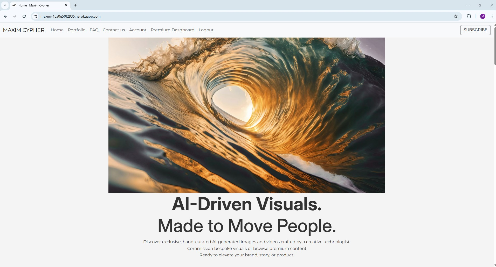
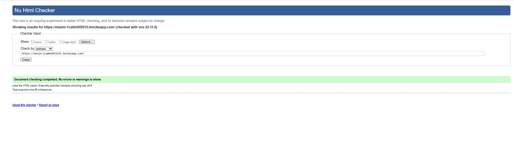
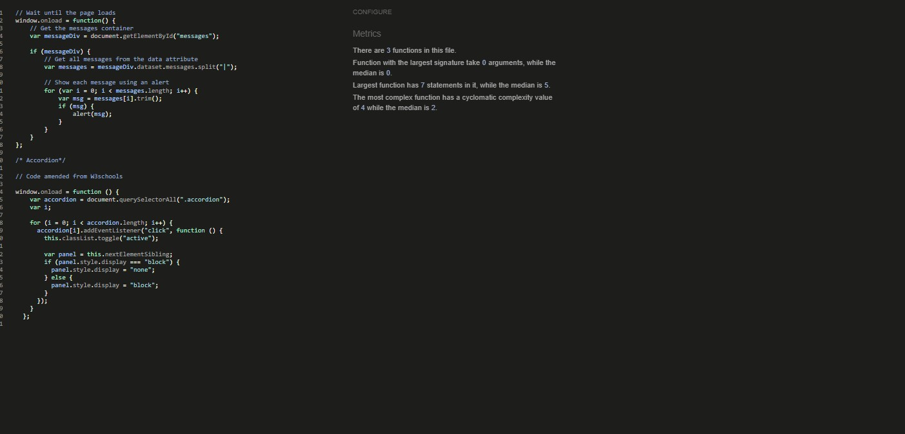

# Maxim Cypher

Maxim Cypher is a **Full Stack Django platform** that allows users to generate AI-powered custom images and videos, browse free and premium media, and manage subscription plans with automated request limits.Maxim Cypher is not just another AI generator — it is powered by professional prompt engineers who craft every custom image and video request manually.

Instead of users spending hours experimenting with prompts, rewriting descriptions, or trying to figure out how to get the “perfect” visual, Maxim Cypher delivers studio-quality AI outputs by letting experts handle the hard part.

The platform is designed for **content creators, businesses, marketers, and everyday users** who need reliable AI-generated content in a clean and modern UI.

## Why This Matters

- Saves users time — no need to learn prompt engineering or fine-tune complex AI wording.
- Delivers professional-grade results — every image/video is engineered for quality, story, and visual precision.
- Perfect for businesses & creators — ideal for ads, campaigns, branding, social media, and content production.
- Consistent output — no randomness or failed generations; everything reviewed and crafted by experts.

### What Users Get

Custom AI images crafted by trained prompt engineers

10-second AI videos tailored to the exact user brief

Faster turnaround on paid plans

Clean, polished, ready-to-use visuals for any industry

### Summary

Maxim Cypher provides premium AI media without the learning curve — users simply submit a description, and expert prompt engineers return a refined, high-quality image or video.
This ensures better content, less effort, and a huge time-saver for creators, professionals, and businesses.

Live Site: [Deployment Link Here](https://maxim-1ca0e50f2935.herokuapp.com/)

---

## User Experience (UX)

### User Stories

**As a site user, I want to:**
- Generate custom AI images or videos based on prompts.
- Browse free image galleries without creating an account.
- Upgrade to a Creator or Pro plan for premium access.
- Track my remaining AI requests on my account dashboard.
- Receive fast delivery (Creator: within 1 hour, Pro: within 30 minutes).
- Request custom AI videos (10 seconds max on Pro plan).

**As a site owner, I want to:**
- Manage all custom requests via Django Admin.
- Control user quotas and subscription plans.
- Offer fast-tiered AI delivery times.
- Maintain professional branding and responsive UI.
- Ensure secure subscription billing via Stripe Checkout.

---

## Purpose & Value

Maxim Cypher provides fast AI-generated media on demand for:
- Businesses creating ads or marketing visuals
- Content creators posting to social media
- Marketing teams needing fast turnaround
- Freelancers producing client assets
- Anyone needing high-quality AI media quickly

---

## Branding

### Colour Scheme
- **Black** – modern, bold, high-contrast
- **White** – clean readability
- **Blue accents** – futuristic AI aesthetic

### Typography
- Modern **sans-serif fonts** for clarity
- Clean UI-focused layout

### Imagery
- Free gallery images across the site
- User-generated premium images/videos
- AI branding visuals

---

## Project Features

### 🧭 Navigation Bar
- Sticky navbar across all pages
- Links to: Home, Gallery, Pricing, Login/Register, Account
- Shows Account + Logout only when logged in
- Fully responsive with mobile hamburger menu

### 🏠 Home Page
**Features**
- Hero banner introducing the platform
- Buttons for “Generate” and “Pricing”
- Highlights: Fast Delivery, AI-Powered, Subscription-Based
- *Screenshot Placeholder*

### 🖼️ Free Gallery Page
**Features**
- View images without login
- Grid layout
- Fully responsive
- Search/filter options
- *Screenshot Placeholder*

### ⚙️ Custom AI Request Dashboard
**Features**
- Users can submit prompts for custom images or videos
- Displays remaining request quota
- Creator plan: ~1 hour delivery
- Pro plan: ~30 minutes delivery
- Videos limited to 10 seconds
- *Screenshot Placeholder*

### 💳 Subscription System (Stripe)
**Features**
- Creator & Pro subscription tiers
- Stripe Checkout integration
- Automatic redirects
- Django tracks:
  - User plan
  - Remaining custom requests
  - Cancel anytime
- *Screenshot Placeholder*

### 🧾 Account Page
**Shows:**
- Current plan
- Remaining AI request count
- Upgrade button (if Creator)
- Cancel subscription button

### 🛠️ Admin Panel
**Admins can:**
- View all user requests
- Filter by user, category, priority, or date
- View request details and timestamps
- Delete or manage users

---

## CRUD Functionality

| Area             | Create | Read | Update | Delete |
|------------------|--------|------|--------|--------|
| Users            | ✔      | ✔    | ✔      | ✔      |
| Premium Requests | ✔      | ✔    | ✔      | ✔      |
| Gallery Images   | ✔      | ✔    | ✔      | ✔      |

---

## Database Schema

**User (Custom Fields)**
- `plan` (free / creator / pro)
- `custom_images_remaining` (Int)

**PremiumRequest**
- `user` (FK)
- `title`
- `description`
- `category`
- `priority`
- `created_at`

**GalleryImage**
- `title`
- `image_file`
- `category`

---

## Development Process

- **Version control**: Git & GitHub.  
- **Commit messages**: Small, descriptive, documenting progress.  
- **Process followed**:  
  1. Planning (wireframes, schema design, UX goals).  
  2. Setup (Django project, models, apps, templates).  
  3. Implementation (CRUD, forms, feedback).  
  4. Styling (CSS branding, responsive grid).  
  5. Testing (manual and validation).  
  6. Deployment (local + Heroku).  
  7. Planned user flows  
  8. Designed database schema  
  9. Implemented authentication & Allauth  
  10. Added subscription logic with Stripe  
  11. Built premium request system 

---

### Solved bugs

1. Although I had created a superuser locally, I had to recreate the superuser on heroku so the admin panel could show up.

2. The booking form was showing an error like "Select a valid choice" for the package or time slot, even when the options looked right. Amended the packages to make sure they were in the data base, made sure the timeslots were being correctly passed into the form and updated mismatch between my local code and Heroku by updating  models and running migrations properly. (This issue came up because Heroku wasn't deployed on time—I had to wait for my GitHub Student Pack to get free credits for hosting).

3. Had an issue with favicons not working with normal links in base.html and so had to use template tags.

---

### Unsolved bugs

1. Attempted to have a pop up alert message when there is a duplicate booking but site kept generating a message on the booking for due to the Django auto generated message from errors. Had to resort to using javascript within the home.html where the form is selected to scroll to the form on error. However the issue with the pop up message still stands as won't work. 

2. Issue with my bookings page showing an error in HTML checker regarding an aria label but there are no aria labels advised on the page or on login page etc. 
---

## Deployment

### Local Deployment
- git clone https://github.com/MunasheMuk2/maxim.git
- cd maxim-cypher
- python -m venv venv
- venv\Scripts\activate
- pip install -r requirements.txt
- python manage.py migrate
- python manage.py createsuperuser
- python manage.py runserver

---

##  Remote Deployment (Heroku)

- Deployed with **Heroku**, using **PostgreSQL** as the database.  
- `Procfile` and `requirements.txt` included for deployment.  
- Environment variables managed in **Heroku Config Vars**.  
- `DEBUG = False` in production for security.  

---

## Security

- Used **SECRET_KEY** 
- `.gitignore` excludes sensitive files.  
- `DEBUG` disabled in production.  

---

##  Credits

- **Media**: Images sourced from [Unsplash](https://pixabay.com & generated images on https://sora.chatgpt.com/)  
- **Code References**: code institute and youtube tutorials

## Technologies Used

- [VSCode](https://code.visualstudio.com/)  Used as the main code editor
- [GitHub](https://github.com/) code host for the site
- [W3schools](https://www.w3schools.com) 
- Code institute tutorials for setting up models, apps, templates and heroku
-**Favicons**: Sourced from [favicon](https://favicon.io/)
---

# Further testing

## Compatibility

In order to confirm the correct functionality, responsiveness, and appearance:

+ The website was tested on popular browsers : Chrome and Microsoft edge

    - Chrome:

    

     - Microsoft Edge:

    

---

## Responsiveness

+ Also checked the website's responsiveness in devtools - Chrome.

    - Extra small devices:

    

    ---

    - Small devices:

    

    ---

    - Medium devices:

    

    ---
    
     - large/Xl devices:

    
---
## Manual Testing (Maxim Cypher)

### Site Users
| User Story | Test Action | Expected Result | Status |
|---|---|---|---|
| Generate custom image | Submit an image request with a prompt | Request saved; remaining custom requests decreases | Yes |
| Generate custom video | Submit a video request | Request saved | Yes |
| View free gallery assets | Visit `/gallery` | Images load, responsive grid displays correctly | Yes |
| Upgrade subscription | Visit `/account` → click Upgrade to Pro | Redirects to Stripe Checkout | Yes |
| Cancel subscription | Visit `/account` → Cancel Plan | Plan resets to Free; remaining requests = 0 | Yes |
| Track remaining requests | Visit `/account` | Correct custom requests left displayed for Free/Creator/Pro plans | Yes |
| Authentication | Register → login → logout | All authentication flows work via Django-Allauth | Yes |
| Smooth navigation | Use navbar on desktop/mobile | All links functional; mobile menu collapses properly | Yes |
| Input validation | Submit custom request with empty prompt | Validation error displayed | Yes |

---

### Site Owner / Admin
| User Story | Test Action | Expected Result | Status |
|---|---|---|---|
| Manage Creator Applications | Admin → Creator applications | View, approve, update, or delete creator applications | Yes |
| Manage Premium Requests | Admin → Premium requests | View AI image/video requests, filter by user, delete | Yes |

---

## Functional Testing (Manual)

### 1. Custom Request Form (Images & Videos)
| Case | Steps | Expected | Result |
|---|---|---|---|
| Valid image request | Enter prompt → select “Image” → Submit | Request saved; quota decremented | Yes |
| Valid video request (Pro) | Enter prompt → select “Video” → Submit | Request saved | Yes |
| Missing prompt | Leave prompt empty → Submit | Error: “Prompt is required” | Yes |
| Exceeded quota | Set quota = 0 → Submit | Error: “No requests remaining on your plan” | Yes |

---

### 2. Subscription System (Stripe)
| Case | Steps | Expected | Result |
|---|---|---|---|
| Creator upgrade | `/account` → Upgrade → Stripe → Pay | Plan updates to Creator; quota added | Yes |
| Pro upgrade | `/account` → Upgrade → Stripe → Pay | Plan updates to Pro; quota added | Yes |
| Cancel plan | `/account` → Cancel Plan | Plan resets to Free; quota resets | Yes |

---

### 3. Authentication (Allauth)
| Case | Steps | Expected Result | Status |
|---|---|---|---|
| Register new user | Sign up with email/password | Account created; auto-login | Yes |
| Login existing user | Enter valid credentials | Login success | Yes |
| Wrong password | Enter incorrect password | Error message shown | Yes |
| Logout | Click “Logout” | Session ends; redirected to homepage | Yes |

---

## CRUD Coverage

CRUD operations verified through both User Interface and Django Admin Panel.

| Entity | Create | Read | Update | Delete | UI Reflection |
|---|---|---|---|---|---|
| Premium Requests | User/Admin create request | Admin views list | Admin updates status | Admin deletes request | Changes instantly visible on admin dashboard |
| Creator Applications | User applies for creator → admin view | Admin reads app | Admin approves/denies | Admin deletes entries | Approval gives user Creator perks |
| User Accounts | User registers; admin creates | Admin can view details | Admin edits plan/quota | Admin deletes user | Changes reflected on login/account pages |

## Validator testing
## HTML Validation

#### Landing Page
   

- No errors or warnings were found when passing through the official W3C validator.

---

#### Services Page
   

- No errors or warnings were found when passing through the official W3C validator.

---

#### Contact Page
   

- No errors or warnings were found when passing through the official W3C validator.

---

#### Booking Page
   

- No errors or warnings found relating to my bookings page - error for aria label descirbed is non existant. Checked all templates that include a login form, especially:`login.html` , `home.html` and `base.html` 
 
---
+ ### CSS
  No errors or warnings were found when passing through the official W3C (Jigsaw) validator 
    

---

+ ### JSHint

 No errors or warnings were found when passing through the JS code in JSHint. 

   

---

## Acknowledgments

- [Code Institute](https://codeinstitute.net/) 